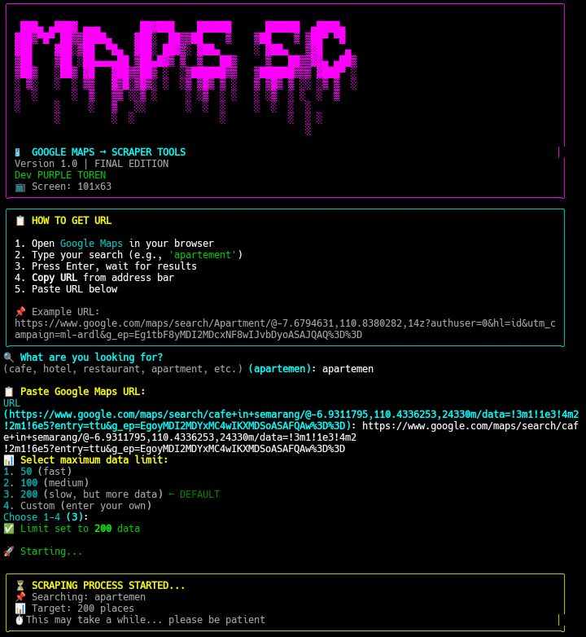

# 🗺️ Google Maps Scraper

A comprehensive, production-ready Python tool for extracting business and location data from Google Maps, generating interactive HTML reports with 3D visualization, and delivering them directly to your Telegram with zero local storage footprint. Perfect for market research, competitor analysis, lead generation, and location-based intelligence gathering.

---

## 📸 Screenshot

### Main Menu Interface


---

## 📋 Table of Contents

- [Overview](#overview)
- [Features](#features)
- [Installation](#installation)
- [Usage Guide](#usage-guide)
- [How to Get Google Maps URL](#how-to-get-google-maps-url)
- [Telegram Setup](#telegram-setup)
- [Output Format](#output-format)
- [Project Structure](#project-structure)
- [Requirements](#requirements)
- [Troubleshooting](#troubleshooting)
- [FAQ](#faq)
- [Contributing](#contributing)
- [Credit](#credit)
- [License](#license)

---

## 📖 Overview

**Google Maps Scraper** is a powerful Python-based automation tool designed to extract valuable business and location data from Google Maps search results. Whether you're a market researcher, business owner, data analyst, or developer, this tool simplifies the process of collecting structured data from one of the world's largest location databases.

The tool leverages Playwright for browser automation, providing reliable and accurate data extraction that mimics human browsing behavior. Unlike simple HTTP requests, Playwright handles JavaScript-rendered content, ensuring you get complete and up-to-date information from Google Maps.

The extracted data is then transformed into an interactive HTML report featuring Three.js 3D visualization, making data exploration engaging and intuitive. The final output is delivered directly to your Telegram account without any files being stored locally, ensuring privacy and convenience.

---

## ✨ Features

### Core Functionality
- **Automated Google Maps Scraping** – Extracts business and location data from Google Maps search results with high accuracy and reliability.
- **Comprehensive Data Extraction** – Captures place names, ratings, phone numbers, addresses, and direct Google Maps links for each entry.
- **Intelligent Data Filtering** – Automatically removes duplicate entries and filters valid data points to ensure clean results.
- **Scalable Data Limits** – Choose from 50, 100, 200, or custom data limits to suit your specific needs and time constraints.
- **Real-time Progress Tracking** – Visual progress bars and status updates keep you informed throughout the scraping process.

### Output & Visualization
- **Interactive 3D HTML Reports** – Beautiful, self-contained HTML files featuring Three.js 3D models and responsive design.
- **Multiple 3D Model Options** – Choose from 5 different interactive 3D visualizations.
- **Clickable Data Table** – Each place name is linked directly to its Google Maps location for instant access.
- **Responsive Design** – HTML output works seamlessly on desktop, tablet, and mobile devices.
- **No Local Storage** – All data is processed in memory and sent directly to Telegram without any local file storage.

### User Interface
- **Full Screen Adaptive** – Terminal UI automatically adjusts to your screen size and resolution.
- **Rich Terminal Experience** – Beautiful colors, panels, tables, and progress bars using the Rich library.
- **Interactive Input Validation** – Smart URL validation and user-friendly prompts guide you through the process.
- **Clear Status Updates** – Every step of the process is clearly communicated with colored output.

### Telegram Integration
- **Direct Delivery** – HTML files are sent directly to your Telegram chat without storing them locally.
- **Rich Captions** – Detailed captions with statistics including total data, elite ratings, and scan time.
- **One-Click Access** – Open the HTML file directly from Telegram on any device.
- **Secure Communication** – Uses Telegram's secure Bot API for file delivery.

---

## 🚀 Installation

### Prerequisites

| Requirement | Version | Check Command |
|-------------|---------|---------------|
| Python | 3.7 or higher | `python3 --version` |
| Pip | Latest | `pip --version` |
| Git | Latest (optional) | `git --version` |
| Internet | Stable connection | – |

### Method 1: Via Git (Recommended)

```bash
# Clone the repository
git clone https://github.com/username/maps-scraper.git
cd maps-scraper

# Install Python dependencies
pip install -r requirements.txt --break-system-packages

# Install Playwright browser
playwright install chromium

# Verify installation
python3 -c "import playwright, requests, rich; print('✅ All dependencies installed')"


